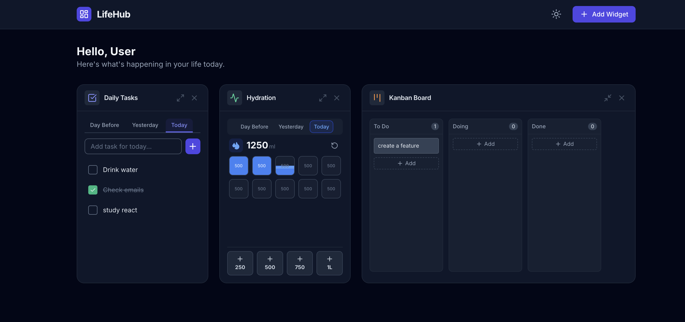

# LifeHub Dashboard

A centralized personal dashboard designed to streamline your daily life by tracking tasks, habits, notes, and wellness, powered by AI insights. Now with a robust backend for data persistence.



## 📚 Table of Contents

- [Features](#-features)
- [Installation (Docker)](#-installation-docker---recommended)
- [Security & Privacy](#-security--privacy)
- [Development Guide](#%EF%B8%8F-development-guide)

---

## ✨ Features

### Widgets

#### 🏠 General

- **Daily Tasks**: Manage tasks for Today, Yesterday, and the Day Before with smart rollover.
- **Notes**: Tabbed interface for multiple notes.
- **Quick Links**: Save and organize frequently visited websites.

#### ⚡ Productivity

- **Kanban Board**: Drag-and-drop style task management (To Do, Doing, Done).
- **Reminders**: Track upcoming events and deadlines.
- **Pomodoro Timer**: Focus timer with work/break intervals.

#### 🩸 Health

- **Hydration Tracker**: Track water intake with history and visual progress.
- **Gym Tracker**: Log workouts and track history.
- **Diet Tracker**: Monitor daily calorie and macro intake.

#### 🤖 AI Coach

- **Multi-Provider Support**: Compatible with Google Gemini, OpenAI, and Anthropic.
- **Context Aware**: The AI analyzes your current tasks, hydration, and notes to provide personalized advice.
- **Chat Interface**: Interact directly with your data.

### System Capabilities

- **💾 Data Persistence**: Self-hosted SQLite backend with automatic backups.
- **🔐 Multi-User**: Secure JWT authentication with data isolation per user.
- **♻️ Widget Restoration**: Soft delete system allows restoring widgets with their previous data.

---

## 🚀 Installation (Docker) - Recommended

The easiest way to run LifeHub is using Docker. This method is perfect for self-hosting on your personal server, NAS, or Raspberry Pi (CasaOS, ZimaOS, etc.).

### Quick Start

Run the following command to start LifeHub:

```bash
docker run -d \
  --name lifehub \
  -p 8080:8080 \
  -v $(pwd)/data:/app/data \
  gabrielhirakawa/lifehub:latest
```

- **Access**: Open `http://localhost:8080` in your browser.
- **Data Persistence**: Your database and keys will be saved in the `./data` folder on your host machine.

### CasaOS / ZimaOS

1. Click on **Custom Install** (or the "+" button).
2. **Docker Image**: `gabrielhirakawa/lifehub:latest`
3. **Web UI Port**: `8080`
4. **Volumes**:
   - Host: `/DATA/AppData/lifehub/data` (or your preferred path)
   - Container: `/app/data`
5. Click **Install**.

---

## 🔒 Security & Privacy

LifeHub was built with security in mind, ensuring you can self-host with confidence.

- **Authentication**: We use **JWT (JSON Web Tokens)** stored in **HttpOnly Cookies**. This means the frontend JavaScript cannot access your session token, protecting you against XSS (Cross-Site Scripting) attacks.
- **Zero-Config Security**: Critical secrets (like the JWT signing key and VAPID keys) are **automatically generated** securely on the first run and stored locally in the `data/` folder. No hardcoded secrets in the source code.
- **Data Isolation**: The SQLite database is stored locally on your server (`data/lifehub.db`). It is not exposed to the network directly, and all API access is protected by authentication middleware.
- **CORS Protection**: The backend is configured to only accept requests from trusted origins (like your frontend), preventing unauthorized websites from making requests to your dashboard.

---

## 🛠️ Development Guide

This section is for developers who want to contribute to LifeHub or modify the source code.

### Technologies

#### Frontend (`/web`)

- **Framework**: React 19, TypeScript, Vite
- **Styling**: Tailwind CSS
- **Icons**: Lucide React
- **AI**: Google GenAI SDK, OpenAI API, Anthropic API
- **PWA**: Service Worker for offline support and notifications

#### Backend (`/cmd`, `/internal`)

- **Language**: Go (Golang) 1.24+
- **Database**: SQLite (via `modernc.org/sqlite` - pure Go driver)
- **Auth**: JWT (JSON Web Tokens) with HttpOnly Cookies
- **Push**: Web Push Library (`webpush-go`)
- **Architecture**: REST API

### Project Structure

```
lifehub/
├── cmd/server/         # Backend entry point
├── internal/           # Backend logic
│   ├── api/            # HTTP Handlers
│   ├── database/       # Database operations
│   └── models/         # Data structures
├── web/                # Frontend application (React)
└── go.mod              # Go dependencies
```

### Local Setup

#### Prerequisites

- Go 1.24 or higher
- Node.js 20 or higher

#### 1. Backend Setup

Start the Go server to handle data persistence.

```bash
# Install Go dependencies
go mod download

# Run the server
go run cmd/server/main.go
```

The server will start on `http://localhost:8080`.
_Note: On first run, it will generate `data/vapid_keys.json` for push notifications._

#### 2. Frontend Setup

In a new terminal, start the React application.

```bash
cd web

# Install dependencies
npm install

# Create .env file for AI features
echo "VITE_GEMINI_API_KEY=your_api_key_here" > .env

# Run the development server
npm run dev
```

The application will be available at `http://localhost:3000`.
